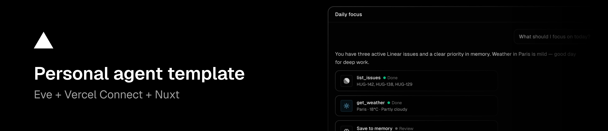

# personal-agent

This fork is the live personal agent: Nuxt web chat + Eve runtime, with Slack, iMessage, GitHub, Linear, and user-approved long-term memory.

**Run:** `pnpm install && cp .env.example .env && pnpm db:migrate && pnpm dev` → http://localhost:3000  
**Required env:** `BETTER_AUTH_SECRET`, `BETTER_AUTH_URL`, `INTERNAL_API_SECRET`  
**Do not** start a second agent repo. Customize `shared/agent.ts` and `agent/lib/base-instructions.ts` here.

---

# Personal Agent Template

**Template.** Fork it, customize it, and deploy your own personal agent.

Open source personal agent template. Web chat, Slack, iMessage, GitHub, Linear, and long-term memory — one codebase, durable sessions, user-approved memory saves.

See [AGENTS.md](./AGENTS.md) and [docs/](./docs/) for architecture, env, and customization. Upstream template: [vercel-labs/personal-agent-template](https://github.com/vercel-labs/personal-agent-template).
